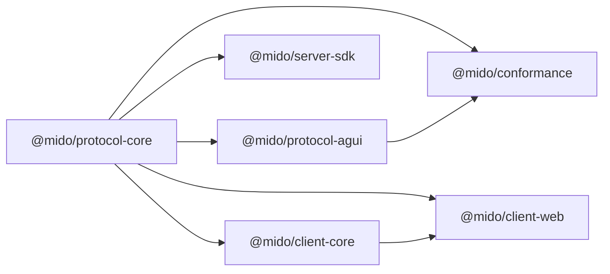

# Architecture

This document explains the v1 package boundaries, ownership model, and runtime responsibilities.

## Design goals

- Keep the agent loop in one place: the server.
- Let clients expose local capabilities without moving agent state to the client.
- Keep the internal protocol independent from any single frontend protocol or model provider.
- Make native clients possible with JSON Schema and conformance tests before shipping full native SDKs.

## Non-goals

- Running a full agent loop on iOS, Android, or desktop clients.
- Using MCP as the primary app client transport.
- Binding the runtime to one provider SDK or one web framework.

## Package layout



## Responsibility split

### `@mido/protocol-core`

- Defines `CoreEvent`, `RunStartRequest`, `RunResumeRequest`, `RunCheckpoint`, and tool envelopes.
- Exports runtime validators and JSON Schema documents.
- Acts as the single source of truth for all SDKs.

### `@mido/protocol-agui`

- Maps `CoreEvent` into AG-UI-shaped events.
- Maps AG-UI events back into `CoreEvent`.
- Uses a custom namespace for capabilities that do not map cleanly.

### `@mido/server-sdk`

- Owns the only agent loop.
- Calls the model adapter.
- Executes `server` tools inline.
- Suspends on `client_auto` and `client_interactive` tools.
- Merges run-scoped client tool definitions from `RunStartRequest.clientTools` into the model-visible tool list.
- Selects no-script Agent Skills and composes their instructions into the server-owned system prompt.
- Stores checkpoints and resumes from tool results.
- Optionally persists thread snapshots and event logs through `ThreadStore` and `EventStore`.

### `@mido/client-core`

- Consumes the event stream.
- Tracks local shared state and tool call status.
- Sends registered client tool definitions with new runs.
- Auto-executes `client_auto` tools.
- Exposes pending `client_interactive` tools to the UI.
- Executes approved `client_interactive` tools and submits rejection results for rejected ones.
- Submits `RunResumeRequest` when a tool result is ready.

### `@mido/client-web`

- Implements `SSE down + POST up`.
- Exposes `useAgentRun`, `useToolCalls`, and `usePendingInteractiveTools`.
- Provides a minimal reference panel for demo and integration debugging.

### `@mido/conformance`

- Exports the schema bundle for non-TypeScript clients.
- Documents native client rules and event ordering.
- Provides round-trip checks for AG-UI compatibility.

## Runtime layers

```text
Layer 1: Provider Adapter
  Converts provider stream parts into model-neutral events.

Layer 2: Server Runtime
  Decides whether a tool runs on the server or must suspend for the client.
  Selects no-script Agent Skills before model invocation.

Layer 3: Wire Protocol
  Streams `CoreEvent` over SSE and accepts `RunResumeRequest` over HTTP POST.

Layer 4: Client Runtime
  Tracks run state, executes local tools, and submits tool results.

Layer 5: UI Layer
  Renders text, tool state, and interactive actions.
```

## Checkpoint contents

The server checkpoint is the minimum state needed to resume a run deterministically.

- `runId`
- `threadId`
- `sequence`
- `messages`
- `clientTools`
- `state`
- `metadata`
- `pendingToolCalls`
- `submittedToolResults`
- `processedToolCallIds`
- `updatedAt`

Durable thread history and event logs are intentionally separate from checkpoints. `SessionStore` can use a short TTL for resumability, while `ThreadStore` and `EventStore` can use longer-lived deployment storage.

## Tool policy matrix

| Execution policy | Executed by | Requires checkpoint | Requires UI |
| --- | --- | --- | --- |
| `server` | Server runtime | No | No |
| `client_auto` | Client runtime | Yes | No |
| `client_interactive` | Client runtime after UI approval | Yes | Yes |

Risk policy is a separate, opt-in server SDK layer. Without `toolPolicy`, tool metadata is only descriptive and existing execution behavior does not change. With `createDefaultToolPolicy()`, the runner hides destructive non-interactive tools from model input and blocks them if a model still asks for them. Destructive `client_interactive` tools remain visible because they already use the approval flow.

## MCP mapping

MCP tools reuse the normal tool policy matrix.

| MCP connection | Mido tool policy | Registered by | Executed by |
| --- | --- | --- | --- |
| Server-side Streamable HTTP MCP | `server` | Server runtime | Server runtime |
| Client-side Streamable HTTP MCP | `client_auto` | Client runtime | Client runtime |

For client-side MCP, the client keeps the execute handler locally but sends the serializable tool definition to the server in `RunStartRequest.clientTools`. The server advertises those tools to the model for that run, then checkpoints when the model calls one. The client receives the tool call, executes the local MCP client, and resumes with a normal `RunResumeRequest`.

## Agent Skills mapping

Agent Skills are instruction/resource packages, not a separate runtime.

| Skill part | Phase 1 behavior | Owner |
| --- | --- | --- |
| `SKILL.md` frontmatter | Indexed at startup | Server |
| `SKILL.md` body | Loaded only after skill selection | Server |
| `references/` | Read on demand through the skill registry | Server |
| `assets/` | Read on demand through the skill registry | Server |
| `scripts/` | Rejected unless `scriptSandbox` is configured; executed through `skill_run_script` | Server sandbox |

Clients can pass `metadata.enabledSkills` as a preference. The server still selects the final skill set and records audit events.

Managed MCP connections live in `@mido/mcp-core`. They track connection state, expose explicit health checks and reconnect helpers, retry a stale tool call once, and return tool refresh diffs. Client SDK refresh can update and remove registered MCP tools. Server SDK refresh returns mapped definitions for the caller to apply deliberately instead of mutating the runner registry while runs may still be active.

## Transport contract

### Downstream

- Server streams `CoreEvent` over SSE.
- A stream ends on:
  - `RUN_FINISHED` with `completed`
  - `RUN_FINISHED` with `awaiting_client_tool`
  - `RUN_ERROR`

### Upstream

- Client sends `RunStartRequest` over HTTP POST.
- The payload may include `clientTools` for local or client-side MCP tools.
- Client sends `RunResumeRequest` over HTTP POST.
- The payload includes:
  - `runId`
  - `toolResult.runId`
  - `toolResult.messageId`
  - `toolResult.toolCallId`
  - `toolResult.toolName`
  - `toolResult.output`
  - `toolResult.submittedAt`
- Rejected interactive tools submit `toolResult.isError: true` and do not execute the local handler.

## Failure handling

- Unknown tool name becomes `RUN_ERROR`.
- Invalid tool input or output schema becomes `RUN_ERROR`.
- Missing checkpoint becomes `RUN_ERROR`.
- Re-submitting the same tool result with the same payload is idempotent.
- Re-submitting the same tool result with a different payload becomes `tool_result_conflict`.

## Storage and tracing

- `ThreadStore` persists the latest snapshot for a `threadId`.
- `EventStore` appends `CoreEvent` records for a `runId`.
- Filesystem implementations are available for local development and simple deployments.
- `CoreEvent.trace` carries optional structured trace metadata.
- `buildRunTrace(events)` turns stored events into an inspector-friendly run summary.

## Native client boundary

Native clients should reuse the same protocol shape, not the web implementation details.

- Read JSON Schemas from `packages/conformance/schemas`.
- Follow `packages/conformance/docs/native-client-contract.md`.
- Keep local transport, tool bridge, and UI platform-specific.
- Keep run state, event ordering, and tool IDs protocol-compatible.
