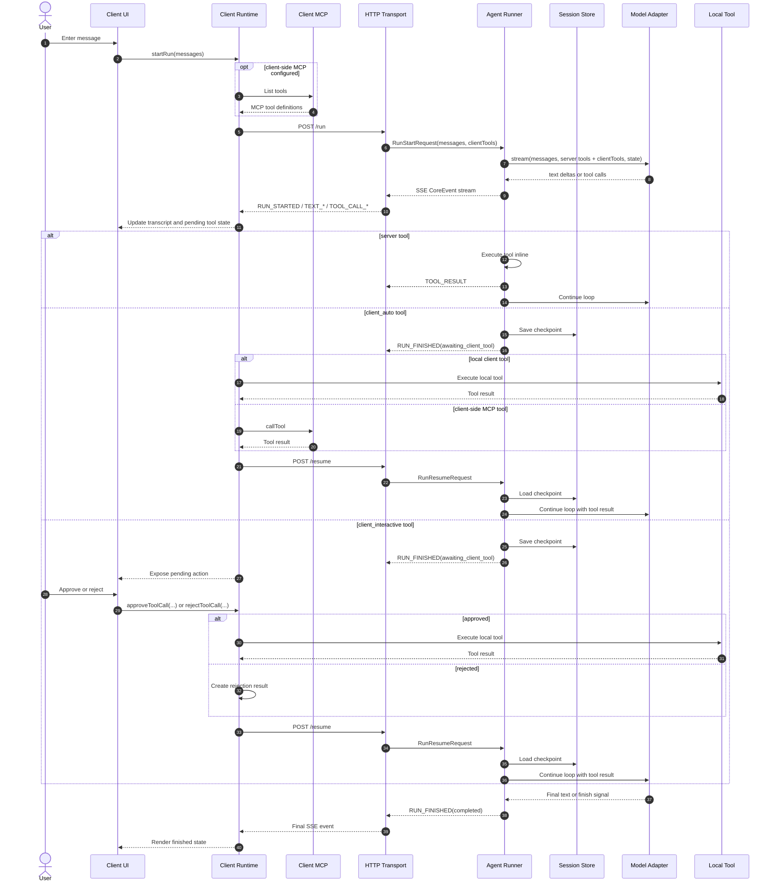
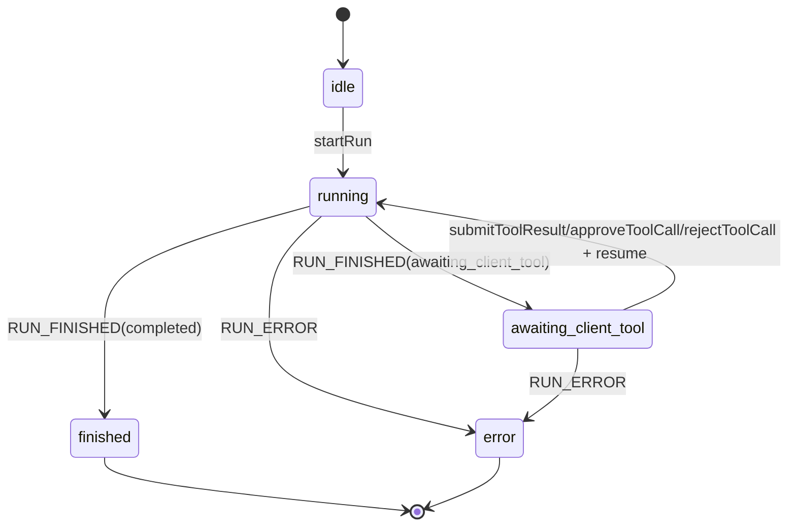

# Data Flow

This document marks the end-to-end flow with explicit step numbers so the SDK boundary is easy to reason about.

## Overall flow

## Step annotations

### 1. User input enters the client runtime

The UI should not talk directly to the server protocol. It calls `startRun`, and the client runtime becomes the owner of local tool state.

### 2. The transport starts a new run

`RunStartRequest` carries the initial messages, optional client tool definitions, shared state, and metadata. The server assigns `runId` if the client did not provide one.

### 3. The server starts the agent loop

The server runner passes messages, tools, state, and metadata into the model adapter. The tool list is the global server registry plus any run-scoped `clientTools`.

### 4. The provider stream is normalized into `CoreEvent`

Text deltas become `TEXT_*`. Tool calls become `TOOL_CALL_*`. Shared state updates become `STATE_DELTA`.

### 5. The client runtime tracks the stream

The client appends text, updates `toolCalls`, and marks `client_interactive` tools as pending UI work. It also owns the execute handlers for local client tools and client-side MCP tools.

### 6. `server` tools stay inside the server loop

The server validates the tool input, executes the handler, validates the result, emits `TOOL_RESULT`, and immediately continues the same run.

### 7. `client_*` tools force a pause

The server saves a checkpoint, including the run-scoped `clientTools`, and ends the current SSE stream with `RUN_FINISHED(awaiting_client_tool)`. This is a pause, not a terminal completion.

### 8. The client decides how to fulfill the tool

- `client_auto`: execute immediately in code
- `client_interactive`: wait for user action, then execute only if approved

For client-side MCP, `client_auto` means the client runtime calls the remote MCP server from the client environment.

### 9. The client resumes the run

The client sends `RunResumeRequest` with the original `runId` and `toolCallId`. This is the stable join point across multiple pauses.

### 10. The server restores context

The server loads the checkpoint, injects the tool result as a tool message, updates state if needed, and restarts the model loop.

### 11. The loop can pause more than once

One run may hit multiple client tools. The same `runId` must survive until the final `RUN_FINISHED(completed)`.

### 12. The final completion closes the run

Only `RUN_FINISHED(completed)` means the agent is done. `RUN_FINISHED(awaiting_client_tool)` means more work is still pending.

## Data ownership

| Data | Owner | Why |
| --- | --- | --- |
| Full run history | Server | The agent loop and checkpoint logic live there |
| Local tool implementation | Client | The capability is local to the device or UI |
| Client-side MCP connection | Client | The MCP execute handler and transport live there |
| Server-side MCP connection | Server | The MCP execute handler and credentials live there |
| Shared protocol types | `protocol-core` | All runtimes need the same identifiers and schemas |
| AG-UI mapping | `protocol-agui` | External compatibility belongs at the edge |

## State transitions

## Read this with the code

- Server loop: `packages/server-sdk/src/runner.ts`
- Client runtime: `packages/client-core/src/index.ts`
- Browser transport and hooks: `packages/client-web/src/index.tsx`
- Shared schemas: `packages/protocol-core/src/index.ts`
